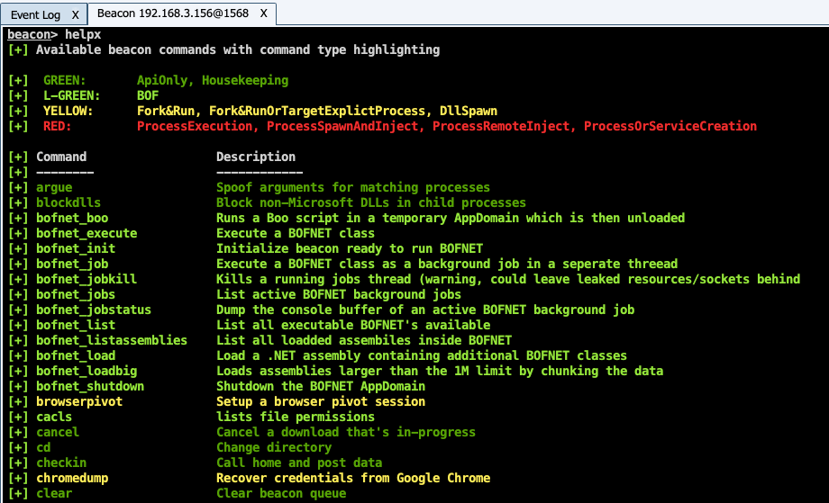

# HelpColor #
Agressor script that lists available Cobalt Strike beacon commands and colors them based on their type

* Colouring for built-in CS commands, based on: https://www.cobaltstrike.com/help-opsec
* Colouring of various custom BOFs/addons

## Usage

```
helpx
```

Example:

  


## Credits
Author: Jarno van de Moosdijk (@jmoosdijk) / Outflank

Inspired by ProcessColor.cna by Harley Lebeau (@r3dQu1nn): https://github.com/harleyQu1nn/AggressorScripts/blob/master/ProcessColor.cna
